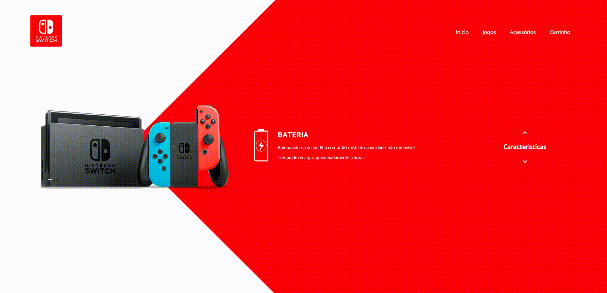

<h1 align="center">
  WebSite Design
</h1>

<h1>
  
</h1>

## 📝 Detalhes do conteúdo
**WebSiteDesign** não responsivo com o tema Nintendo Switch que eu criei para estudar **Javascript** e **CSS**.

---

## 🚀 Tecnologias utilizadas
- Javascript
- CSS

---

## 📁 Como baixar e rodar o projeto
```bash
    # para clonar o repositório
    $ git clone https://github.com/DigooDS/WebSiteDesign.git

    # para entrar no diretório
    $ cd WebSiteDesign

```
- Executar o arquivo **"index.html"**.

---

<i>Desenvolvido por RodrigoDS</i> 🤓